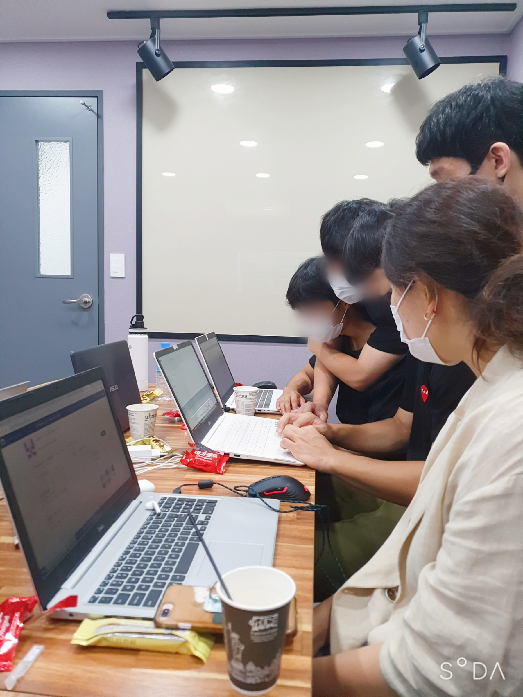

# 부산 개발자 모임 서버 스터디

약 1달간 이루어진 서버 스터디를 기록해놓은 리포지토리입니다.

 

## 참가자

멘토 : [강상위 님](https://github.com/khudev-ksw)

학생 : 
[이건호 님](./), 
[홍지혜 님](https://github.com/jola7373), 
[채기중 님](https://github.com/KIJUNG-CHAE), 
[유동엽 님](https://github.com/yudongyeop), 
[조영우 님](https://github.com/yeongwooCho), 
[김현우 님](https://github.com/Coalery)

 

## 프로젝트

스터디에서 학생들이 만든 프로젝트들 입니다.

### 음식 알림기

1. 바코드의 정보와 공공 데이터 API를 통해 음식의 정보를 불러와서 등록한다.

2. 등록된 음식의 유통기한이 임박하면 사용자에게 알려주고, 관련 레시피를 불러와 보여준다.

개발자 : 김현우 님

#### 사용 기술

AWS(EC2, DynamoDB), Flutter(Dart)

#### 관련 리포지토리

https://github.com/Coalery/FoodNotifier_FE

https://github.com/Coalery/FoodNotifierBE_RDB

https://github.com/Coalery/FoodNotifierBE_NoSQL

 

## 1차 스터디 / 2020. 08. 01.

 

## 2차 스터디 / 2020. 08. 08.

 

## 3차 스터디 / 2020. 08. 15.

 

## 4차 스터디 / 2020. 08. 22.

 

## Hack Day / 2020. 08. 29.

 

> 모자이크가 없는 원본 사진이 필요하신 분은 [여기](mailto:doralife12@naver.com)로 연락주세요!
